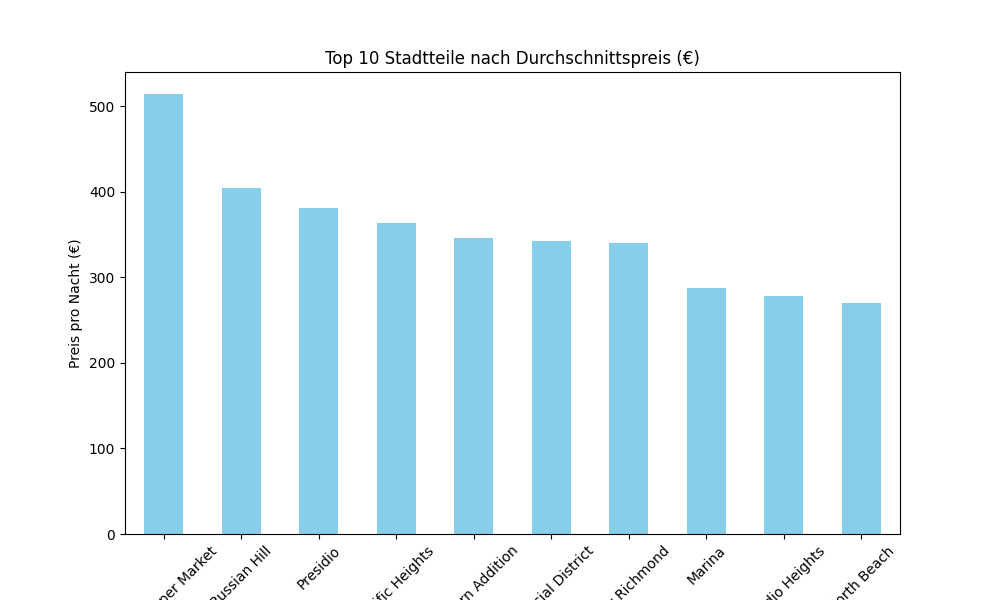
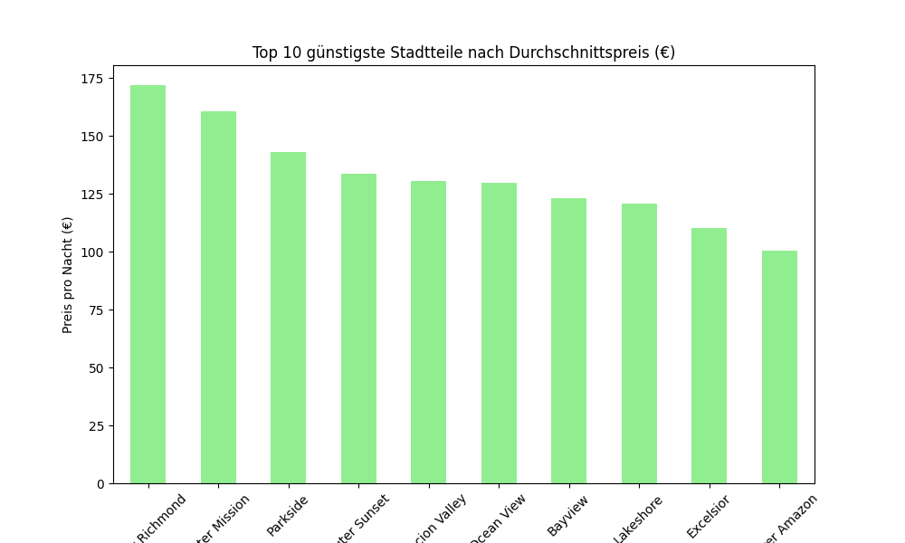

# 📊 Airbnb Data Analysis – Preis- und Stadtteilanalyse 🏠

In diesem Projekt werden die Airbnb-Daten einer Stadt untersucht,  
um Einblicke in Preisstrukturen, Unterkunftsarten und Unterschiede zwischen Stadtteilen zu erhalten.

## 🚀 Ziel des Projekts
- Wie verteilen sich die Preise für Airbnb-Unterkünfte in der Stadt?
- Welche Unterkunftstypen (z. B. Wohnung, Privatzimmer) sind am teuersten?
- In welchen Stadtteilen sind die Unterkünfte besonders teuer oder günstig?

## 📂 Projektstruktur
- `data/` – Rohdaten (z. B. `listings.csv`)
- `notebooks/` – Jupyter Notebook mit der Analyse (`airbnb_analysis.ipynb`)
- `visuals/` – Diagramme und Plots als PNG-Dateien
- `scripts/` – Python-Skripte (optional)

## 📊 Ergebnisse (Auswahl)
### 🔸 Preisverteilung
Die meisten Unterkünfte kosten weniger als 200 € pro Nacht,  
es gibt jedoch einige Ausreißer im Luxussegment.

### 🔸 Preise nach Unterkunftstyp
- Ganze Wohnungen sind im Schnitt am teuersten.
- Privatzimmer sind günstiger, Gemeinschaftszimmer am günstigsten.

### 🔸 Top 10 teuerste Stadtteile


### 🔸 Top 10 günstigste Stadtteile


## 📦 Installation & Nutzung
```bash
pip install pandas matplotlib seaborn jupyter
jupyter notebook notebooks/airbnb_analysis.ipynb
